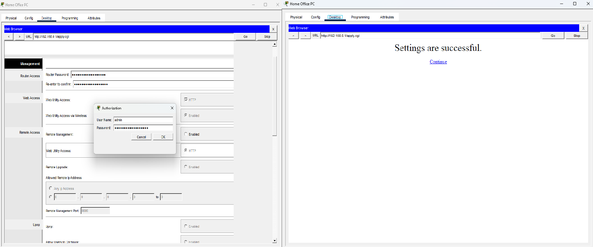
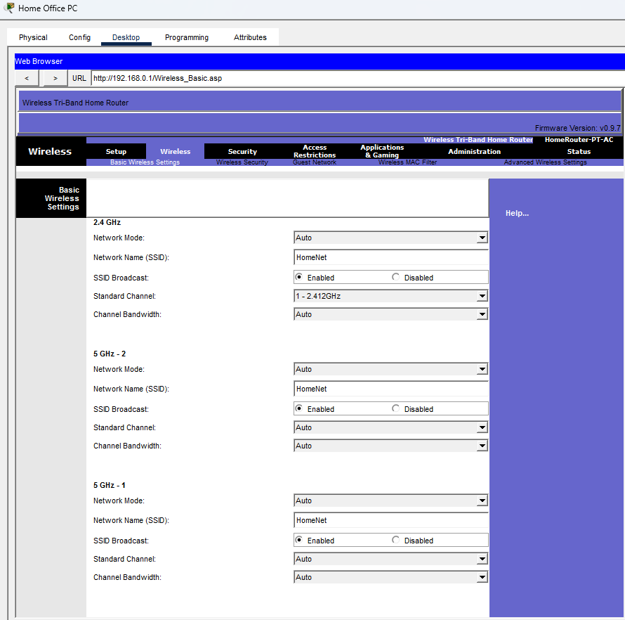
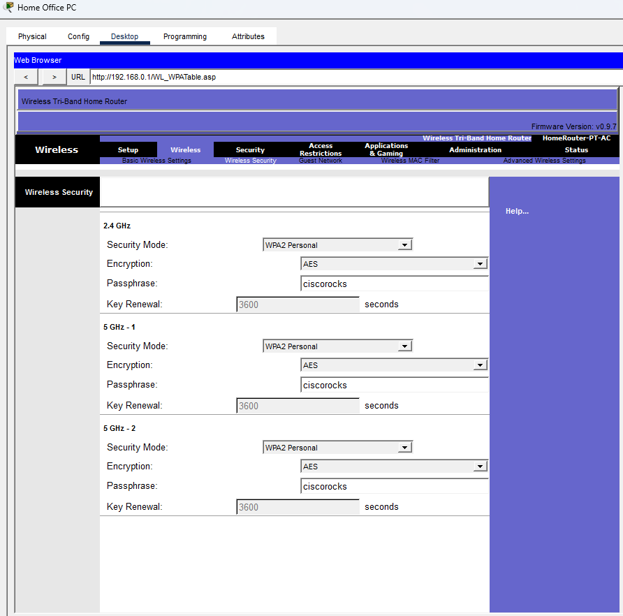
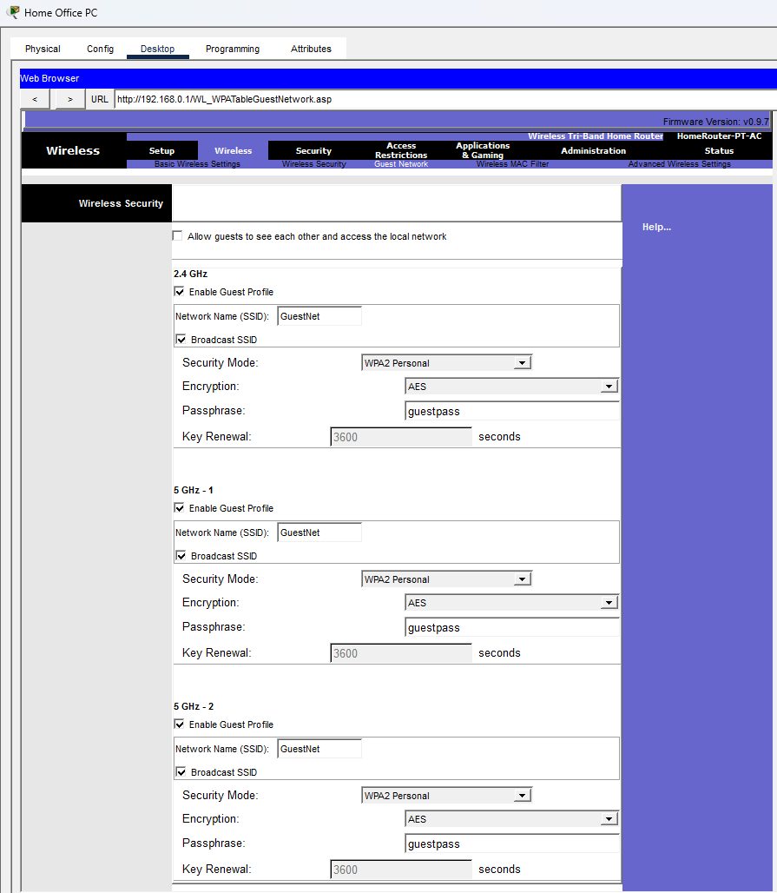
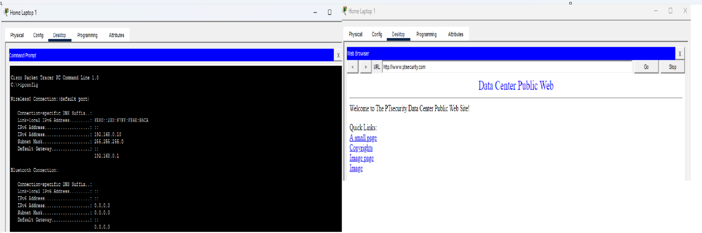
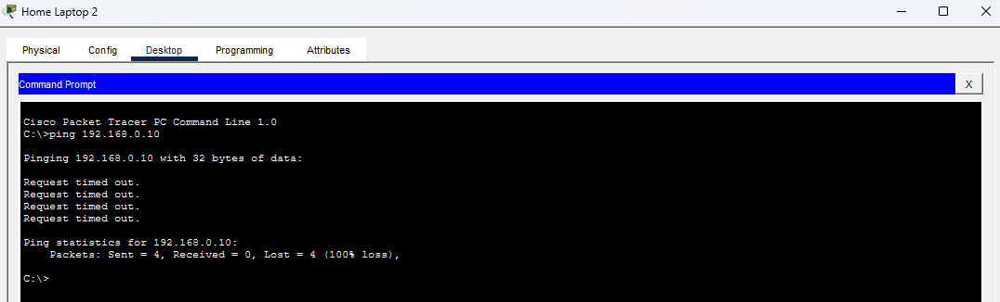

# Hardening y Segmentación de Redes Inalámbricas SOHO

## Descripción
En este laboratorio se realiza el proceso de securización (*hardening*) y segmentación de un entorno de red inalámbrico SOHO (Small Office / Home Office) utilizando Cisco Packet Tracer. El proyecto aborda la transición de una red local con parámetros de fábrica (inseguros) hacia una infraestructura inalámbrica robusta, implementando controles de cifrado avanzados, mitigación de riesgos administrativos y aislamiento de red para visitantes (*Guest Isolation*).

---

## Objetivos del Laboratorio
* **Hardening Administrativo:** Reducir la superficie de ataque del router SOHO mediante la actualización de credenciales por defecto y la inhabilitación del acceso administrativo remoto.
* **Cifrado y Autenticación:** Implementar un esquema de seguridad inalámbrico basado en **WPA2-Personal (AES)**.
* **Segmentación y Aislamiento:** Configurar una red dedicada para invitados (**GuestNet**) con aislamiento de clientes activo (*AP / Guest Isolation*) para prevenir movimiento lateral hacia la LAN corporativa y el ecosistema IoT.
* **Verificación Práctica:** Validar la conectividad a Internet y auditar la efectividad de los controles de seguridad mediante pruebas de ICMP (*ping*) y navegación HTTP.

---

## Topología de Red

---

## Tecnologías y Conceptos Aplicados
* **Hardware/Software:** Cisco Packet Tracer, Wireless Router SOHO Tri-Band, Clientes Windows y Dispositivos IoT.
* **Protocolos y Estándares:** Wi-Fi (IEEE 802.11), WPA2-Personal, AES, DHCP, HTTP, ICMP.
* **Conceptos de Ciberseguridad:** Hardening de dispositivos, Least Privilege, AP Isolation, Mitigación de Movimiento Lateral, Superficie de Ataque.

---

## Tabla de Direccionamiento y Parámetros

| Dispositivo | Interfaz | SSID / Perfil | Autenticación | Cifrado | Dirección IP / Subred | Asignación |
| :--- | :--- | :--- | :--- | :--- | :--- | :--- |
| **Home Wireless Router** | LAN / Wireless | N/A | Local | N/A | `192.168.0.1 /24` | Estática |
| **Home Office PC** | FastEthernet0 | N/A (Cableada) | N/A | N/A | `192.168.0.x /24` | DHCP |
| **Home Laptop 1** | Wireless0 | `HomeNet` | WPA2-Personal | AES | `192.168.0.10 /24` | DHCP |
| **Home Laptop 2** | Wireless0 | `GuestNet` | WPA2-Personal | AES | `192.168.0.x /24` | DHCP |
| **Ecosistema IoT** | Wireless0 | `HomeNet` | WPA2-PSK | AES | `192.168.0.x /24` | DHCP |

---

## Desarrollo Paso a Paso

### Paso 1: Hardening Administrativo del Router
1. Acceso al panel web administrativo del router (`192.168.0.1`) mediante credenciales por defecto (`admin/admin`).
2. Modificación de la contraseña predeterminada por una clave robusta (`cisconetacadrocks!`).
3. Inhabilitación de **Remote Management** para evitar la exposición de la interfaz administrativa hacia la red externa (WAN/Internet).

* **¿Por qué se realiza?** Dejar credenciales por defecto o el acceso remoto habilitado permite que atacantes externos o usuarios no autorizados tomen el control total del router.

---

### Paso 2: Configuración de Redes Inalámbricas y Cifrado
1. **Red Principal (`HomeNet`):** Habilitación del SSID Broadcast en las bandas de 2.4 GHz y 5 GHz.
2. **Seguridad Inalámbrica:** Configuración del modo **WPA2-Personal** con cifrado **AES** y frase de paso `ciscorocks`.

3. **Red de Invitados (`GuestNet`):** Creación del perfil de invitados con cifrado **WPA2-Personal / AES** y contraseña `guestpass`.
4. **Aislamiento de Red (*Guest Isolation*):** Desmarcado explícito de la casilla **Allow guests to see each other and access the local network**.

* **¿Por qué se realiza?** El cifrado WPA2 con AES asegura la confidencialidad del tráfico frente a escuchas pasivas (*sniffing*). Deshabilitar la comunicación entre invitados evita que un equipo comprometido en la red de visitas pueda escanear, atacar o realizar movimiento lateral hacia la LAN privada o los dispositivos IoT.

---

### Paso 3: Asociación de Clientes y Verificación de Conectividad
Se asociaron las Laptops y el ecosistema IoT (cámara, sirena, cerraduras inteligentes) a sus respectivos SSIDs asignados por DHCP.

* **Navegación Web Exitosa:** Desde **Home Laptop 1** se verificó la correcta resolución de nombres y navegación hacia `www.ptsecurity.com`.

---

### Paso 4: Auditoría de Seguridad y Pruebas de Aislamiento
Para verificar el control de aislamiento activo, se ejecutó una prueba de conectividad ICMP (`ping`) desde **Home Laptop 2** (red de invitados) hacia la IP de **Home Laptop 1** (`192.168.0.10`).

* **Resultado:** Las peticiones arrojaron un **`Request timed out`** (100% loss), confirmando que el router bloquea el tráfico de capa 3 entre ambas zonas, protegiendo con éxito la red interna.

---

## Conceptos Aprendidos
* **Seguridad por Oscuridad vs. Cifrado:** Ocultar el SSID (*SSID Hiding*) no brinda seguridad real; el cifrado robusto (**WPA2/AES**) es el control fundamental.
* **Principio de Mínimo Privilegio en Redes:** Separar a los usuarios por niveles de confianza e impedir la visibilidad mutua reduce dramáticamente el impacto de una brecha de seguridad.
* **Hardening de Dispositivos Perimétricos:** Desactivar la administración remota reduce la superficie de exposición ante escaneos de vulnerabilidades automatizados.

---

## Posibles Mejoras para Entornos de Producción
* **Implementación de WPA3:** Migrar a WPA3-Personal para obtener mayor protección contra ataques de fuerza bruta fuera de línea (*SAE Handshake*).
* **VLANs Dedicadas:** Implementar segmentación por VLANs físicas/lógicas en switches en lugar de segmentación basada únicamente en el AP/Router SOHO.
* **Filtrado MAC / 802.1X Enterprise:** Integrar autenticación basada en servidor RADIUS (802.1X) para entornos corporativos.

---

## Conclusión
La correcta aplicación de políticas de hardening y la activación de mecanismos de aislamiento transforman una red SOHO vulnerable en un entorno segmentado y seguro. Este laboratorio demuestra la capacidad práctica para configurar, auditar y documentar medidas defensivas clave en infraestructuras de red.
